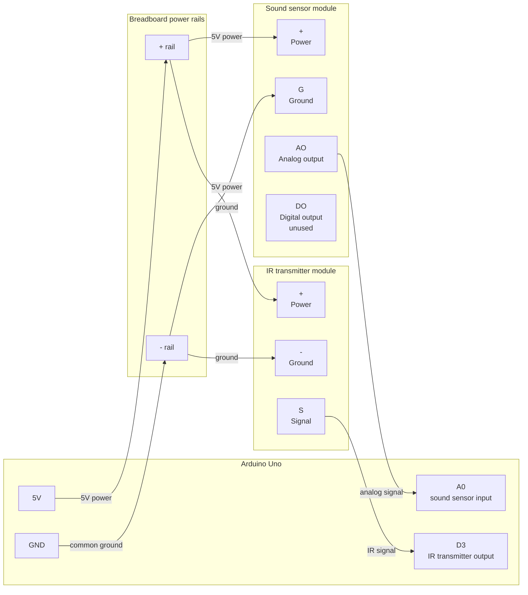

# Automatic TV Audio Level Controller
Arduino-based prototype that automatically adjusts TV volume using sound-level detection and IR remote signals.

## Materials
- Arduino Uno
- Infrared transmitter module
- Sound sensor module
- Jumper wires
- Breadboard
- A device for detecting IR signal codes (ex: Flipper Zero)

## Wiring Diagram
See [docs/wiring.md](docs/wiring.md) for the full wiring diagram.



## Runtime Configuration
- Protocol for TV. Ex: `NEC`
- Hex code address for TV remote: `0x01`
- Hex codes for `Volume Up` & `Volume Down` on TV remote: 
- Repeats: how many extra times Arduino repeats the IR command after the first send `{0, 1, 2, 3}`

## Standalone Battery Mode

Before running the Arduino from battery power, upload the sketch with Serial prompts disabled:

```cpp
// #define ENABLE_SERIAL_CONFIGURATION
```

If `ENABLE_SERIAL_CONFIGURATION` is still enabled, the Arduino can wait for Serial Monitor input & appear to do nothing when it is not connected to your computer.

## Troubleshooting
- **Sound readings do not change**: confirm `AO` is connected to `A0`.
- **TV does not respond**: confirm IR transmitter `S` is connected to `D3`.
- **TV still does not respond**: move the IR LED closer and point it directly at the TV's IR receiver.
- **Works on USB but not battery**: confirm Serial prompts are disabled before uploading.