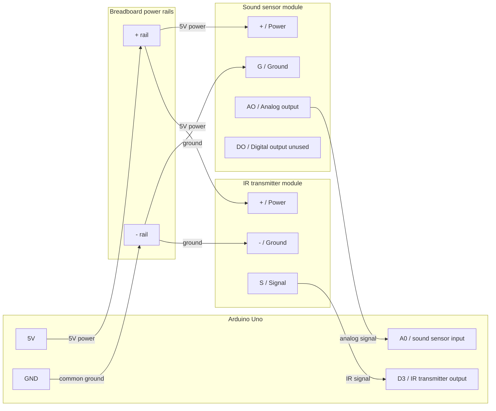

# Automatic TV Audio Level Controller
An Arduino-based prototype that automatically adjusts TV volume using
sound-level detection and infrared remote signals.

## Materials
- Arduino Uno
- Infrared transmitter module
- Sound sensor module
- Jumper wires
- Breadboard
- Optional: A device for detecting IR signal codes (ex: Flipper Zero)

## Wiring Diagram
See [docs/wiring.md](docs/wiring.md) for the full wiring diagram.



## Runtime Configuration
- Protocol for TV. Ex: `NEC`
- Hex code address for TV remote: `0x01`
- Hex code for `Volume Down` on TV remote
- Too-loud threshold for automatic adjustment
- Fast safety threshold for immediate adjustment

## Sound Level Measurement

The sensor's analog output (`AO`) is sampled through Arduino pin `A0` in
250 ms windows. For each window, the sketch calculates the standard deviation:
how much the readings moved above and below their average. It divides that
result by the Arduino Uno's maximum ADC reading of `1023` to produce
`normalizedLevel`. This is a relative sensor level, not a decibel measurement.

Both control rules use this standard-deviation-based level:

- **Sustained loudness:** averages the last 12 levels, representing 3 seconds
  of sound. If that rolling average exceeds `0.001`, it sends 2 volume-down
  commands.
- **Fast safety:** checks only the current 250 ms level. If it exceeds `0.0015`,
  it immediately sends 5 volume-down commands.

The raw average sensor reading is only used to calculate standard deviation;
it does not control the TV volume directly. If both rules trigger together,
the sustained-loudness rule takes priority. After any adjustment, the history
is cleared and the controller waits 2 seconds before adjusting again.

In simple terms, the controller measures how much the microphone signal is
moving. It reacts strongly to one sudden spike, or more gently when that
movement remains high for several seconds. The per-window calculation uses
[Welford's method](https://en.wikipedia.org/wiki/Algorithms_for_calculating_variance#Welford's_online_algorithm), which keeps
an updated average and variation as each sensor reading arrives.

The Serial Monitor reports:

- `normalizedLevel`: standard deviation divided by `1023.0`
- `rollingAverage`: average of the latest normalized levels
- `samples`: number of analog readings collected
- `action`: whether the controller sent a volume-down command

## Standalone Battery Mode

Serial configuration prompts are enabled by default. Before uploading a build
that will run on battery power, comment out this line near the top of the
Arduino sketch:

```cpp
#define ENABLE_SERIAL_CONFIGURATION
```

The sketch has the same instruction immediately above that line. Uncomment the
line again when you want to configure the controller through Serial Monitor.

## Troubleshooting
- **Sound readings do not change**: confirm `AO` is connected to `A0`.
- **TV does not respond**: confirm IR transmitter `S` is connected to `D3`.
- **TV still does not respond**: move the IR LED closer and point it directly
  at the TV's IR receiver.
- **Works on USB but not battery**: confirm Serial prompts are disabled before
  uploading.
