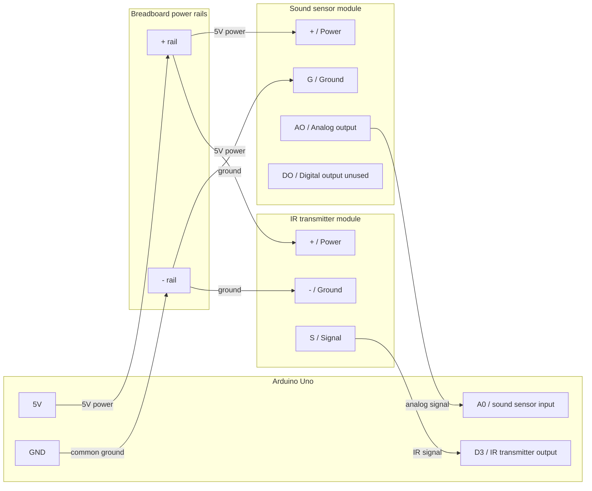

# Automatic TV Audio Level Controller
An Arduino-based prototype that automatically adjusts TV volume using
sound-level detection and infrared remote signals.

## Materials
- Arduino Uno
- Infrared transmitter module
- Sound sensor module
- Jumper wires
- Breadboard
- A device for detecting IR signal codes (ex: Flipper Zero)

## Wiring Diagram
See [docs/wiring.md](docs/wiring.md) for the full wiring diagram.



## Runtime Configuration
- Protocol for TV. Ex: `NEC`
- Hex code address for TV remote: `0x01`
- Hex code for `Volume Down` on TV remote
- Too-loud threshold for automatic adjustment

## Sound Level Measurement

The sound sensor is read through its analog output (`AO`) on Arduino pin
`A0`. The sketch samples the sensor over short 250 ms windows and
calculates how much the sensor readings vary during each window.

The main measurement is the standard deviation of the sensor readings. That
works well for this project because the microphone signal sits around a
baseline voltage, then moves above and below that baseline when sound is
present. A louder sound generally makes the readings move farther from the
average baseline.

For each 250 ms sample window:

```text
average = sum(readings) / number_of_readings

variance = sum((reading - average)^2) / number_of_readings

standardDeviation = sqrt(variance)

standardDeviationLevel = standardDeviation / 1023.0
```

`1023.0` is the largest possible analog reading on the Arduino Uno, so
the last step normalizes the standard deviation to a `0.00` through `1.00`
scale.

The sketch also smooths the normalized standard deviation over time. Each
new measurement only moves the smoothed value part of the way toward the
latest reading. This keeps the controller from reacting too aggressively to
one noisy sample window, while still allowing it to respond when the TV stays
loud for multiple windows.

The smoothing calculation is:

```text
smoothedLevel =
  (0.10 * standardDeviationLevel) +
  (0.90 * previousSmoothedLevel)
```

The threshold is applied to `smoothedLevel`, not to one raw sample window.
When `smoothedLevel` stays above the too-loud threshold for 8 windows, the
Arduino sends the TV's volume-down command. With 250 ms windows, that means
the sound must remain loud for about 2 seconds before the volume changes.

Standard deviation with smoothing was chosen for the control decision
because TV volume should only be reduced when the sound stays loud, not when
the sensor catches one brief period of loud sound.

## Standalone Battery Mode

Before running the Arduino from battery power, upload the sketch with Serial
prompts disabled:

```cpp
// #define ENABLE_SERIAL_CONFIGURATION
```

If `ENABLE_SERIAL_CONFIGURATION` is still enabled, the Arduino can wait for
Serial Monitor input & appear to do nothing when it is not connected to your
computer.

## Troubleshooting
- **Sound readings do not change**: confirm `AO` is connected to `A0`.
- **TV does not respond**: confirm IR transmitter `S` is connected to `D3`.
- **TV still does not respond**: move the IR LED closer and point it directly
  at the TV's IR receiver.
- **Works on USB but not battery**: confirm Serial prompts are disabled before
  uploading.
