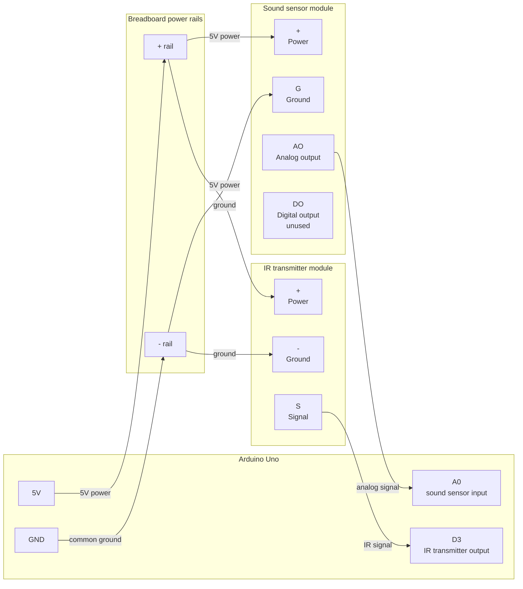

# Automatic TV Audio Level Controller
An Arduino-based prototype that automatically adjusts TV volume using
sound-level detection and IR remote signals.

## Materials
- Arduino Uno
- Infrared transmitter module
- Sound sensor module
- Jumper wires
- Breadboard
- A device for detecting IR signal codes (ex: Flipper Zero)

## Wiring Diagram
See [docs/wiring.md](docs/wiring.md) for the full wiring diagram.



## Runtime Configuration
- Protocol for TV. Ex: `NEC`
- Hex code address for TV remote: `0x01`
- Hex code for `Volume Down` on TV remote
- Too-loud threshold for automatic adjustment

## Sound Level Measurement

The sound sensor is read through its analog output (`AO`) on Arduino pin
`A0`. The sketch samples the sensor over short 250 ms windows and
calculates a Root Mean Square sound level from those samples.

**Root Mean Square level (RMS)** estimates the overall strength of the
changing sound signal during the sample window. This is the main value used
for automatic volume adjustment because it represents sustained loudness
better than a single momentary spike. The code normalizes this value to a
`0.00` through `1.00` scale before comparing it to the too-loud threshold.

The sketch also smooths the RMS level over time. Each new measurement only
moves the smoothed value part of the way toward the latest reading. This
keeps the controller from reacting too aggressively to one noisy sample
window, while still allowing it to respond when the TV stays loud for
multiple windows.

RMS with smoothing was chosen for the control decision because TV volume
should only be reduced when the sound stays loud, not when the sensor
catches one brief period of loud sound.

## Standalone Battery Mode

Before running the Arduino from battery power, upload the sketch with Serial
prompts disabled:

```cpp
// #define ENABLE_SERIAL_CONFIGURATION
```

If `ENABLE_SERIAL_CONFIGURATION` is still enabled, the Arduino can wait for
Serial Monitor input & appear to do nothing when it is not connected to your
computer.

## Troubleshooting
- **Sound readings do not change**: confirm `AO` is connected to `A0`.
- **TV does not respond**: confirm IR transmitter `S` is connected to `D3`.
- **TV still does not respond**: move the IR LED closer and point it directly
  at the TV's IR receiver.
- **Works on USB but not battery**: confirm Serial prompts are disabled before
  uploading.
