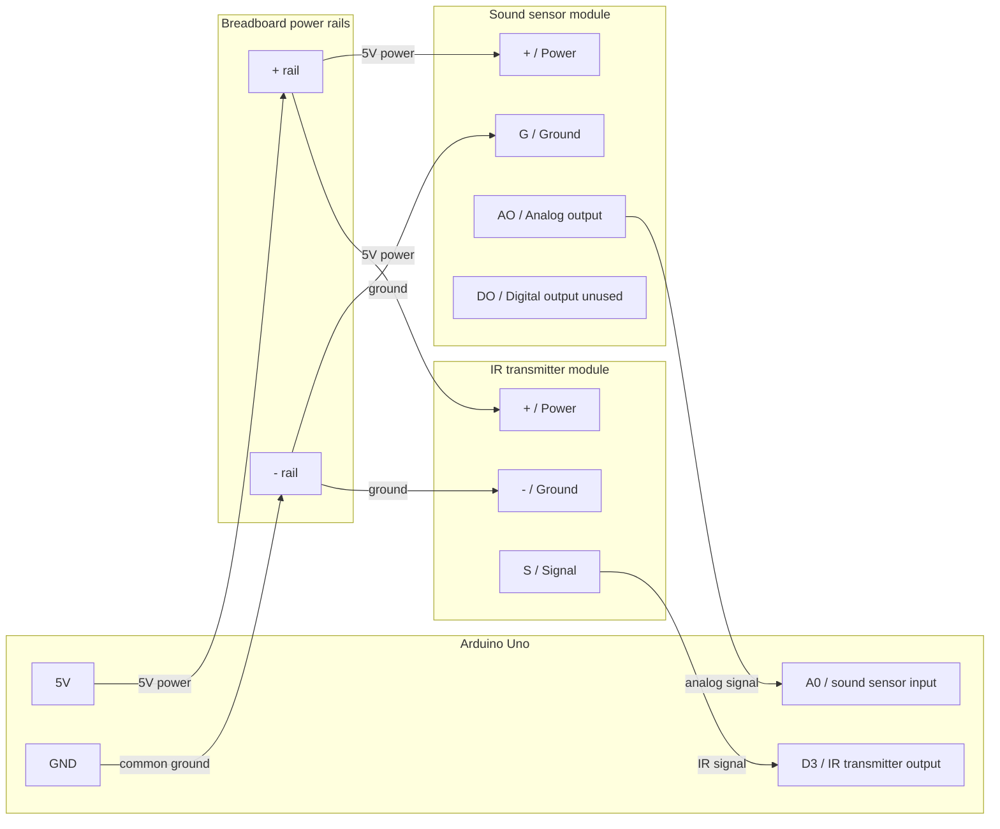

# Wiring Diagram

This project uses an Arduino Uno, an analog sound sensor module, and an IR transmitter module. The sound sensor reads the TV audio level, and the IR transmitter sends the TV's volume-down command.

## Connection Table

| Component | Component pin | Arduino / breadboard connection |
| --- | --- | --- |
| Sound sensor | `AO` | Arduino `A0` |
| Sound sensor | `G` | Breadboard `-` rail / Arduino `GND` |
| Sound sensor | `+` | Breadboard `+` rail / Arduino `5V` |
| Sound sensor | `DO` | Unused by this project |
| IR transmitter | `S` | Arduino `D3` |
| IR transmitter | `+` | Breadboard `+` rail / Arduino `5V` |
| IR transmitter | `-` | Breadboard `-` rail / Arduino `GND` |

## Breadboard Wiring Steps

1. Connect Arduino `5V` to the breadboard `+` rail.
2. Connect Arduino `GND` to the breadboard `-` rail.
3. Connect sound sensor `+` to the breadboard `+` rail.
4. Connect sound sensor `G` to the breadboard `-` rail.
5. Connect sound sensor `AO` directly to Arduino `A0`.
6. Do not use sound sensor `DO`; the project reads from `AO`.
7. Connect IR transmitter `+` to the breadboard `+` rail.
8. Connect IR transmitter `-` to the breadboard `-` rail.
9. Connect IR transmitter `S` directly to Arduino `D3`.

## Placement

- Point the IR transmitter LED at the TV's IR receiver.
- Put the sound sensor near the listening position or near the TV, depending on what level you want it to react to.
- Do not place the sound sensor directly against the TV speaker.
